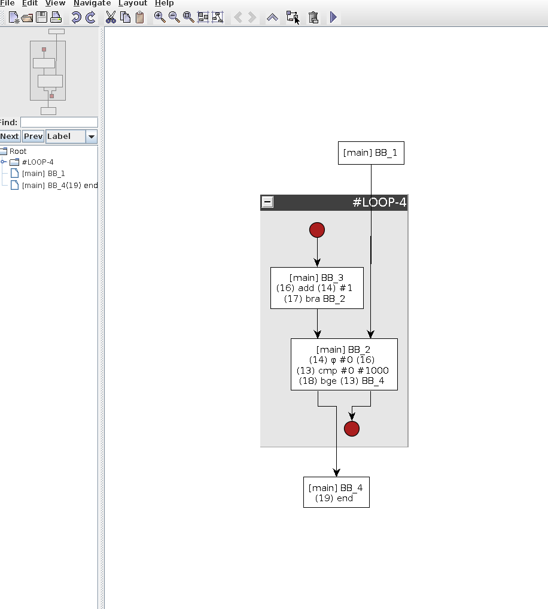

Papyrus
-------

### Description

This project was developed as part of the requirements for CS241 - Advanced Compiler Construction, instructed by Prof. Michael Franz at UC Irvine. Papyrus is an optimizing compiler for PL241, a toy-language. More details about the project and the language can be found [here](https://github.com/chinmaydd/Papyrus/tree/master/utils).

### Building and usage

```sh
$ git clone https://github.com/chinmaydd/Papyrus
$ cd Papyrus
$ mkdir bin
$ cd bin
$ cmake ..
$ make
$ # binary availale at ./src/Papyrus/papyrus
$ ./src/Papyrus/papyrus file_name.txt
```

### Visualization

The graphs are generated using the VCG format. Please use [yComp](https://pp.ipd.kit.edu/firm/yComp.html) to visualize them.

##### Example code:

```
// test008.txt
main
var i, j;
{
    let i <- 0;
    let j <- 0;
    while i < 1000 do
        let j <- j + 1
    od
}.
```

##### Visualization



### Relevant Literature

- [Simple and Efficient Construction of Static Single Assignment Form](https://link.springer.com/chapter/10.1007/978-3-642-37051-9_6) - This project angles away from traditional dominator-style SSA IR generation and instead uses the Karlsruhe Method as proposed by Braun et. al. Globals and array handling was particularly interesting when implementing this method. More information can be found in [SSA.cpp](https://github.com/chinmaydd/Papyrus/blob/master/src/IR/SSA.cpp) and [ASTWalk.cpp](https://github.com/chinmaydd/Papyrus/blob/master/src/IR/ASTWalk.cpp).

- [Register Allocation via spilling and graph coloring](https://cs.gmu.edu/~white/CS640/p98-chaitin.pdf)

### Future work

To be honest, there's a lot to be achieved. In no order of importance:

- [proj] Instruction Scheduling and Code Generation: These two steps form the crux of a compiler backend. Unfortunately, I haven't had the bandwidth to implement both of these phases but their development should be orthogonal to what has been already implemented.
- [proj] Since all of the modules mostly work independently with each other, I would also want to implement IR generation using the traditional dominator-based approach as described by [Cytron et. al](https://c9x.me/compile/bib/ssa.pdf) and compare specific points of ease and pain when handling this particular language.
- [proj] Better heuristics for Register Allocation
<br />  

- [devel] Rewriting the IR structure - If I had to implement the project again, there would be a lot of things I would do differently. For example, the API for `Function` is bloated and there is a lot of metadata duplication across the datastructures in IR.h. A first task here would be weed out the unnecessary details and rewrite the IR to be more cleaner.
- [devel] Automatic Memory Management - You will notice that although the project is in C++, it does not make use of smart pointers. It should. Currently, allocated memory is not managed and it is left to the OS to manage it for us.

### Why Papyrus?

Papyrus is a legendary character from [Undertale](https://undertale.com/), which I highly recommend. The name's pretty cool too.

### License

This project is licensed under the [MIT license](https://github.com/chinmaydd/Papyrus/blob/master/LICENSE).
